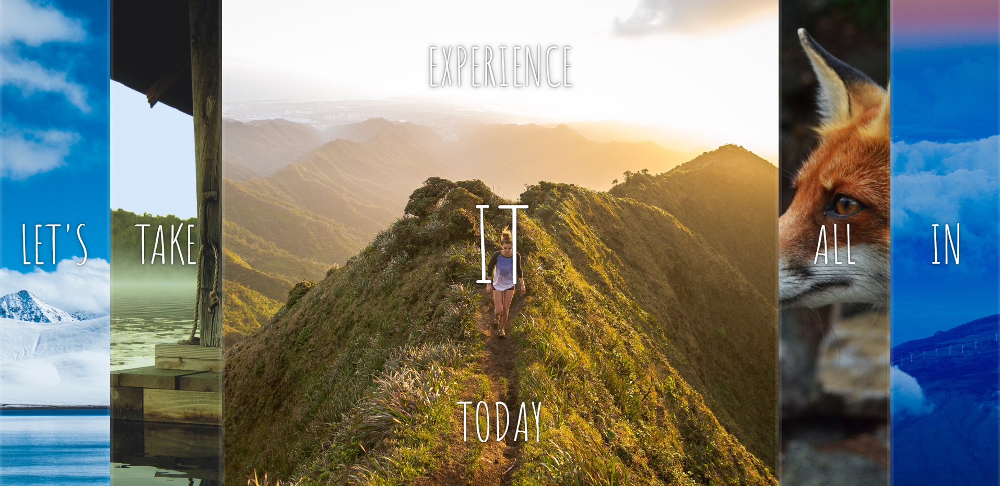
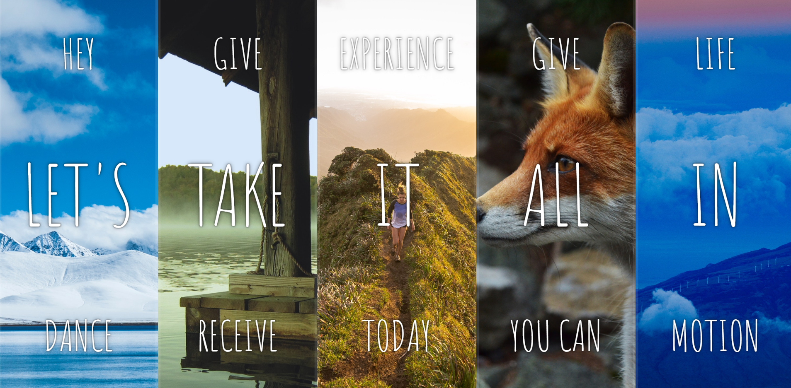

This is a flex gallery from the Wes Bos 30 day JavaScript Challenge. It was fun to make, but I am hoping to make it so that the one you clicked first will close when you click the next one. Wasn't able to figure it out yet, but I'll come back to it.

